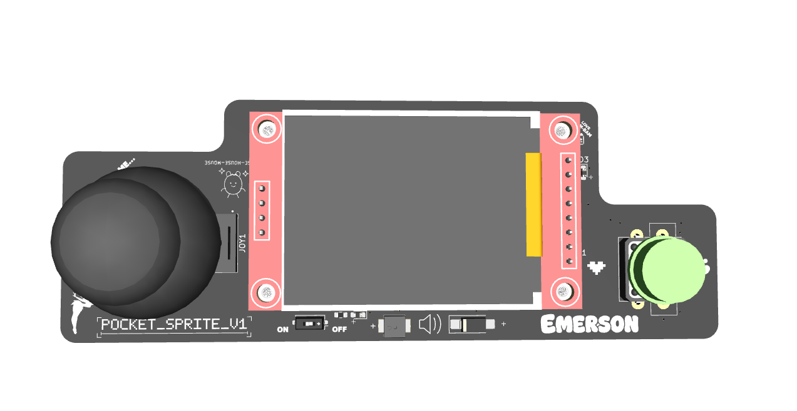
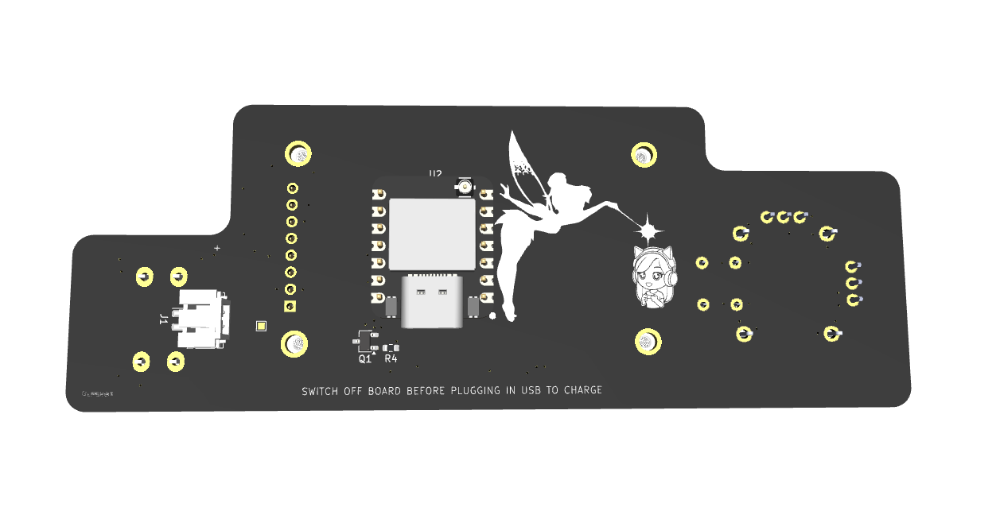

# POCKET_SPRITE

<p align="center">
  
</p>

<p align="center">
  
</p>

A custom ESP32-S3 handheld game console with joystick input, an action button, ST7735 color TFT display, buzzer audio, battery power, custom PCB artwork, and multiple built-in mini games.

POCKET_SPRITE is a compact original hardware project built around the Seeed Studio XIAO ESP32-S3 and a 1.8-inch ST7735 SPI TFT display. The board combines custom electronics, embedded firmware, pixel graphics, playful silkscreen art, and portable battery-powered hardware into a small handheld game device.

## Project Status

In progress. Breadboard input/display testing completed before the PCB version. Current hardware direction uses the XIAO ESP32-S3, joystick, 1.8-inch SPI TFT, A button, TFT backlight control, buzzer output, battery input through the XIAO BAT pads, and a switched 3.3V rail for game hardware.


## Features

- Seeed Studio XIAO ESP32-S3
- 1.8-inch ST7735 SPI TFT display
- Joystick input
- One action button
- TFT backlight control
- Buzzer output
- Battery input through the XIAO battery pads
- Switched 3.3V rail for game hardware
- Custom PCB outline
- Custom silkscreen artwork
- LovyanGFX display driver
- Multiple built-in games and modes

## Games / Modes

Current firmware includes:

- **Adventure**: small character-based adventure game
- **Pocket Pet**: virtual pet room with movement, jumping, ball pushing, and ball kicking
- **Dress Up**: character creator with selectable gender, hairstyles, colors, outfits, shoes, and a small playable character
- **BM Tron**: light-cycle style trail game
- **Snake**: classic snake mini game

## Hardware

| Function | Part / Notes |
|---|---|
| MCU | Seeed Studio XIAO ESP32-S3 |
| Display | 1.8-inch ST7735 SPI TFT |
| Display driver | LovyanGFX |
| Input | Joystick + one A button |
| Audio | Buzzer driven from GPIO |
| Power | Battery connected to XIAO BAT pads |
| Switched rail | XIAO_3V3 → switch → +3V3_SW |
| Board role | Portable handheld game/demo board |

## Pin Map

| XIAO Pin | Net | Function |
|---|---|---|
| D0 | JOY_SW | Joystick press |
| D1 | JOY_X | Joystick X analog |
| D2 | JOY_Y | Joystick Y analog |
| D3 | A_JUMP | A / jump button |
| D4 | CS | TFT chip select |
| D5 | DC | TFT data/command |
| D6 | RST | TFT reset |
| D7 | B-LITE | TFT backlight |
| D8 | SCK | TFT SPI clock |
| D9 | CHIRP | Buzzer drive |
| D10 | MOSI | TFT SPI MOSI |
| 3V3 | XIAO_3V3 | Regulated 3.3V from XIAO |
| GND | GND | Ground |
| BAT+ | XIAO_BAT+ | Battery positive |
| BAT- | XIAO_BAT- | Battery negative |

## Joystick Calibration

Breadboard joystick values measured during testing:

| Axis / Direction | Value / Behavior |
|---|---|
| X center | about 1970 |
| Y center | about 2020 |
| Deadzone | about 450 |
| UP | X low |
| DOWN | X high |
| LEFT | Y high |
| RIGHT | Y low |

Firmware should use calibration/deadzone handling instead of assuming perfect center values.

## Display Interface

The display is a 1.8-inch ST7735 SPI TFT.

```text
TFT CS    → D4
TFT DC    → D5
TFT RESET → D6
TFT BL    → D7 / B-LITE
TFT SCK   → D8
TFT MOSI  → D10
```

## Controls

```text
Joystick SW → D0
Joystick X  → D1
Joystick Y  → D2
A button    → D3
```

The joystick direction mapping from breadboard testing:

```text
UP    → X low
DOWN  → X high
LEFT  → Y high
RIGHT → Y low
```

## Audio Output

The buzzer output is labeled `CHIRP` and is driven from D9.

```text
D9 / CHIRP → buzzer drive
```

If the buzzer current is above the safe GPIO drive range, use a transistor or MOSFET driver instead of driving the buzzer directly from the XIAO GPIO.

## Power Design

The battery connects directly to the XIAO battery pads. The XIAO provides the regulated 3.3V rail used by the game hardware.

```text
Battery → XIAO BAT pads
XIAO_3V3 → switch → +3V3_SW
+3V3_SW → joystick / display / buzzer support hardware
```

Battery support should follow the Seeed Studio XIAO ESP32-S3 battery/BAT pad guidance for a 1S LiPo setup.

## Firmware Direction

Useful firmware modules:

- Joystick calibration
- Direction/deadzone handling
- A button input
- LovyanGFX display setup
- ST7735 display drawing helpers
- Sprite drawing and animation loop
- Game state/menu system
- Buzzer tone/beep helper
- Backlight control
- Battery-aware sleep or low-power behavior later

## Bring-Up Checklist

1. Confirm XIAO ESP32-S3 orientation and soldering.
2. Verify XIAO_3V3 and +3V3_SW behavior.
3. Test joystick X/Y ADC values.
4. Test joystick switch.
5. Test A button.
6. Test TFT display init over SPI.
7. Test TFT CS/DC/RESET behavior.
8. Test TFT backlight control on B-LITE.
9. Test buzzer output on CHIRP.
10. Run joystick-controlled movement demo.
11. Run each game mode.
12. Add battery testing only after USB-powered bring-up is stable.

## Design Notes

- Keep TFT SPI traces clean and reasonably short.
- Keep joystick analog lines away from buzzer switching where practical.
- Leave room for finger access around the joystick and A button.
- Keep silkscreen labels readable around controls.
- Treat joystick calibration as firmware data, not fixed ideal values.
- Keep the board small enough to feel handheld, not like a dinner plate with pixels.

## Repository Output Images

Expected image paths for GitHub README rendering:

```text
Outputs/
  IMG/
    3D-T.png
    3D-B.png
    SCHEMATIC.png
    L1-SIG.png
    L2-GND.png
```

## Safety / Design Note

POCKET_SPRITE is a low-voltage handheld electronics project. Verify battery polarity, switched power behavior, buzzer drive current, and display wiring before portable use.

Designed & Engineered by Brandon Shelly